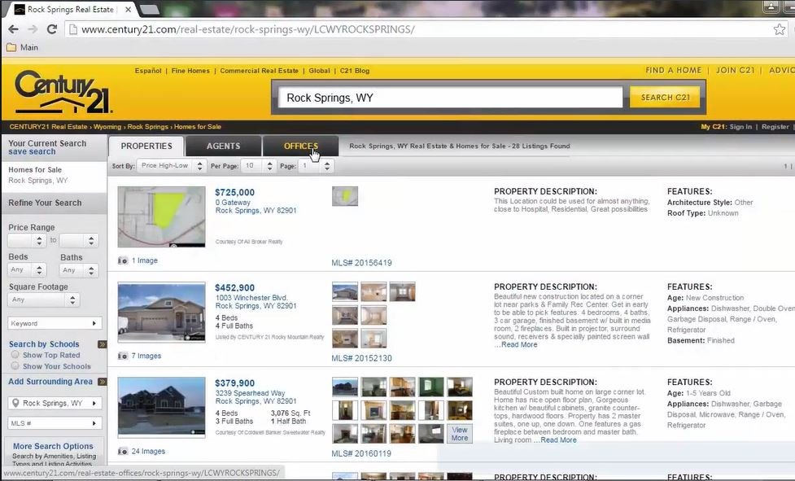
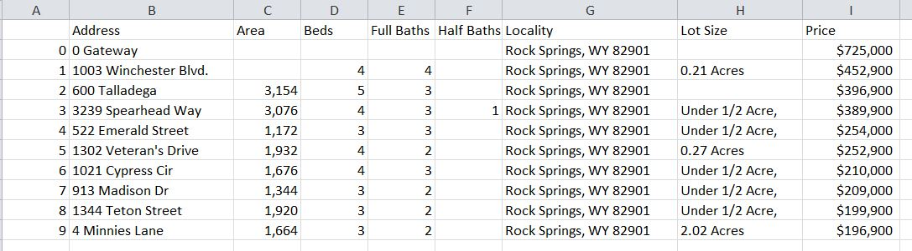

# Python-Scraping-Real-Estate-Data
Python Real-World Application: Scraping real estate property data from the Internet using BeautifulSoup and Requests libraries.
  

I have used the **Century21** website for web scraping. Century21 is a real-estate property website that displays the information related to different properties. I have used a **cached** version of the website because its design has changed while writing the code. Also, I have extracted the data of all the properties in **Rock Springs, Wyoming** only.
  

**Snapshot of the Website**

  

**Snapshot of Output**

